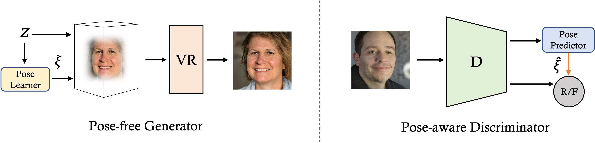
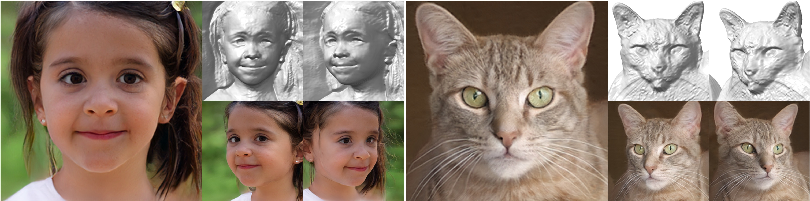
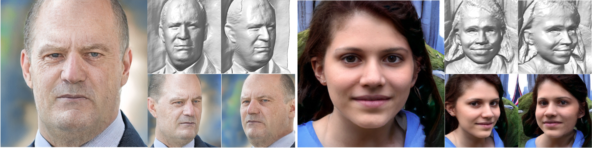
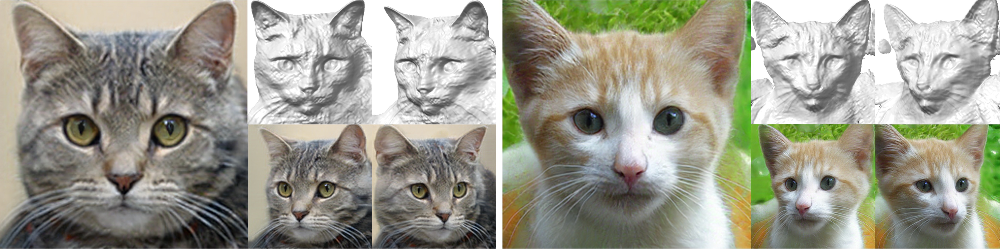
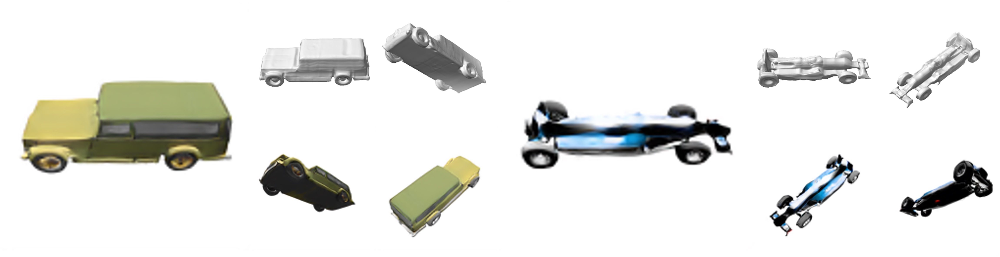

# Learning 3D-aware Image Synthesis with Unknown Pose Distribution

<div align=center>

</div>

Figure: Framework of PoF3D, which consists of a pose-free generator and a pose-aware discriminator. The pose-free generator maps a latent code to a neural radiance field as well as a camera pose, followed by a volume renderer (VR) to output the final image. The pose-aware discriminator first predicts a camera pose from the given image and then use it as the pseudo label for conditional real/fake discrimination, indicated by the orange arrow.

> **Learning 3D-aware Image Synthesis with Unknown Pose Distribution** <br>
> Zifan Shi*, Yujun Shen*, Yinghao Xu, Sida Peng, Yiyi Liao, Sheng Guo, Qifeng Chen, Dit-Yan Yeung <br>
> *CVPR 2023* <br>
> (* indicates equal contribution)



**Figure:** Images and geometry synthesized by <b>PoF3D</b> under random views, <br><i>without any pose prior</i>.

[[Paper](https://openaccess.thecvf.com/content/CVPR2023/papers/Shi_Learning_3D-Aware_Image_Synthesis_With_Unknown_Pose_Distribution_CVPR_2023_paper.pdf)]
[[Project Page](https://vivianszf.github.io/pof3d/)]
[[Supp](https://openaccess.thecvf.com/content/CVPR2023/supplemental/Shi_Learning_3D-Aware_Image_CVPR_2023_supplemental.pdf)]

This work proposes *PoF3D* that frees generative radiance fields from the requirements of 3D pose priors. We first equip the generator
with an efficient pose learner, which is able to infer a pose from a latent code, to approximate the underlying true pose
distribution automatically. We then assign the discriminator a task to learn pose distribution under the supervision
of the generator and to differentiate real and synthesized images with the predicted pose as the condition. The pose-free generator and the pose-aware discriminator are jointly trained in an adversarial manner. Extensive results on a couple of datasets confirm that the performance 
of our approach, regarding both image quality and geometry quality, is on par with state of the art. To our best knowledge, PoF3D 
demonstrates the feasibility of learning high-quality 3D-aware image synthesis <i>without using 3D pose priors</i> for the first time.


## Requirements
We test our code on PyTorch 1.9.1 and CUDA toolkit 11.3. Please follow the instructions on [https://pytorch.org](https://pytorch.org) for installation. Other dependencies can be installed with the following command:
```Shell
    pip install -r requirements.txt
```
Optionally, you can install neural renderer for GeoD support (which is not used in the paper):
```
    cd neural_renderer
    pip install .
```

## Data preparation
FFHQ and ShapeNet cars are borrowed from [EG3D](https://github.com/NVlabs/eg3d). Please follow their instructions to get the dataset. Cats dataset can be downloaded from the [link](https://hkustconnect-my.sharepoint.com/:f:/g/personal/zshiaj_connect_ust_hk/EtHy5-c8lQRDhyqRHYua99cBrtm62OsyRFY5Pol6q5fKMA?e=d2vvGz).

## Training
We provide the scripts for training on FFHQ, Cats and ShapeNet Cars dataset. Please update the path to the dataset in the scripts. The training can be started with:
```Shell
    ./ffhq.sh or ./cats.sh or ./shapenet_cars.sh
```
Note that we provide the [GeoD](https://github.com/vivianszf/geod) supervision option on FFHQ and Cats dataset. But using the default configuration will not use it (which is the configuration we used in the paper). If you would like to try with GeoD, please modify the corresponding arguments.

## Inference
The pretrained models are available [here](https://hkustconnect-my.sharepoint.com/:f:/g/personal/zshiaj_connect_ust_hk/Ejz7GDivpzBKtrBjnnEnr90B9D400CqFWva6Wh9en6WcrA?e=hgg9Jy).

To perform the inference, you can use the command:
```Shell
    python gen_samples_pose.py --outdir ${OUTDIR} 
            --trunc 0.7  
            --shapes true 
            --seeds 0-100 
            --network ${CHECKPOINT_PATH}  
            --shape-res 128 
            --dataset ${DATASET}
```
where `DATASET` denotes the dataset name when training the model. It can be 'ffhq', 'cats', or 'shapenetcars'. `CHECKPOINT_PATH` should be replaced with the path to the checkpoint. `OUTDIR` denotes the folder to save the outputs.


## Results


Syntheses on FFHQ.



Syntheses on Cats.



Syntheses on ShapeNet Cars.



## BibTeX

```bibtex
@article{shi2023pof3d,
  title   = {Learning 3D-aware Image Synthesis with Unknown Pose Distribution},
  author  = {Shi, Zifan and Shen, Yujun, and Xu, Yinghao and Peng, Sida and Liao, Yiyi and Guo, Sheng and Chen, Qifeng and Dit-Yan Yeung},
  booktitle = {CVPR},
  year    = {2023}
}
```
